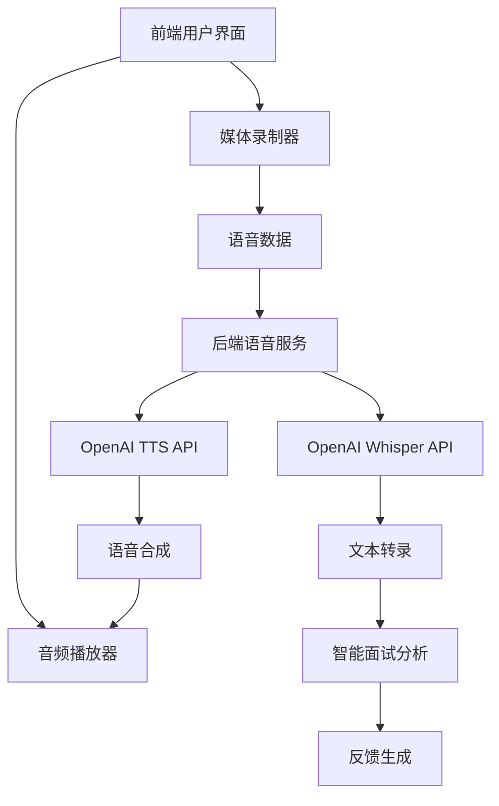

# VITA 实时语音对话模板实现指南

## 🎯 项目概述

本指南详细介绍了VITA (Virtual Interview & Training Assistant) 项目中实时语音对话功能的完整实现。该功能通过集成OpenAI的Whisper和TTS API，为用户提供真实的语音面试体验。

## 🏗️ 系统架构



## 📁 项目结构

```
VITA/
├── backend/
│   ├── core/
│   │   └── speech.py              # 语音服务核心模块
│   ├── main.py                    # API端点 (含语音接口)
│   └── requirements.txt           # Python依赖
├── frontend/
│   ├── src/
│   │   ├── components/
│   │   │   ├── VoiceInterviewer.tsx     # 语音交互组件
│   │   │   └── VoiceInterviewDemo.tsx   # 语音功能演示
│   │   └── store/
│   │       └── useInterviewStore.ts      # 状态管理
│   └── package.json               # Node.js依赖
├── run_services.sh               # Linux/macOS启动脚本
├── run_services.bat             # Windows启动脚本
└── VOICE_FEATURES.md            # 语音功能文档
```

## 🔧 核心实现

### 1. 后端语音服务 (`backend/core/speech.py`)

```python
class SpeechService:
    """核心语音服务类"""
    
    def __init__(self):
        self.client = AsyncOpenAI(api_key=os.getenv("OPENAI_API_KEY"))
        self.supported_formats = ["mp3", "mp4", "mpeg", "mpga", "m4a", "wav", "webm"]
    
    async def speech_to_text(self, audio_data: bytes, language: str = "zh") -> Dict[str, Any]:
        """语音转文字 - 使用OpenAI Whisper"""
        # 实现语音识别逻辑
        
    async def text_to_speech(self, text: str, voice: str = "nova") -> bytes:
        """文字转语音 - 使用OpenAI TTS"""
        # 实现语音合成逻辑
        
    async def analyze_speech_features(self, audio_data: bytes) -> Dict[str, Any]:
        """分析语音特征 - 语速、停顿、流畅度等"""
        # 实现语音分析逻辑
```

### 2. API端点设计 (`backend/main.py`)

```python
# 语音转录
@app.post("/speech/transcribe")
async def transcribe_audio(audio: UploadFile, language: str = "zh")

# 语音合成  
@app.post("/speech/synthesize")
async def synthesize_speech(text: str, voice: str = "nova")

# 语音分析
@app.post("/speech/analyze")
async def analyze_speech(audio: UploadFile)

# 面试问题语音
@app.post("/session/{session_id}/question/audio")
async def get_question_audio(session_id: str)

# 语音回答提交
@app.post("/session/{session_id}/answer/voice")
async def submit_voice_answer(session_id: str, audio: UploadFile)
```

### 3. 前端语音组件 (`frontend/src/components/VoiceInterviewer.tsx`)

```typescript
const VoiceInterviewer: React.FC<VoiceInterviewerProps> = ({
  question,
  onTranscription,
  isVoiceMode,
  onVoiceModeChange
}) => {
  const [isRecording, setIsRecording] = useState(false);
  const [isPlaying, setIsPlaying] = useState(false);
  const [mediaRecorder, setMediaRecorder] = useState<MediaRecorder | null>(null);
  
  // 语音录制功能
  const startVoiceRecording = async () => {
    const stream = await navigator.mediaDevices.getUserMedia({ audio: true });
    const recorder = new MediaRecorder(stream);
    // 录制逻辑实现
  };
  
  // 语音播放功能
  const playQuestionAudio = async () => {
    const response = await fetch('/speech/synthesize', {
      method: 'POST',
      body: new URLSearchParams({ text: question, voice: 'nova' })
    });
    // 播放逻辑实现
  };
  
  return (
    // UI组件渲染
  );
};
```

## 🎤 语音交互流程

### 标准面试对话流程

1. **面试开始**
   ```
   系统: "你好，欢迎参加面试。我是AI面试官，今天将为您进行模拟面试。"
   ```

2. **问题提出**
   ```
   AI面试官: "请简单介绍一下您的工作经验和技术背景。"
   (自动语音播放)
   ```

3. **用户回答**
   ```
   用户: [点击录音按钮] 
   "我有5年的软件开发经验，主要使用Python和JavaScript..."
   [停止录音，自动转录]
   ```

4. **智能追问**
   ```
   AI面试官: "您提到了Python开发经验，能具体说说您参与过的项目吗？"
   ```

5. **面试结束**
   ```
   AI面试官: "感谢您的回答。面试到此结束，稍后将为您生成详细的反馈报告。"
   ```

### 语音分析维度

- **内容质量** (60%)
  - 回答完整性
  - 逻辑清晰度
  - 专业术语使用

- **语音表现** (40%)
  - 语速控制 (120-180 WPM为佳)
  - 停顿合理性 (<3秒停顿)
  - 发音清晰度
  - 流畅度评分

## 🛠️ 开发环境设置

### 1. 环境要求

```bash
# Python 环境
Python 3.8+
OpenAI API Key

# Node.js 环境  
Node.js 16+
npm 或 yarn

# 浏览器支持
Chrome 70+
Firefox 65+
Safari 14+
Edge 80+
```

### 2. 快速启动

```bash
# 克隆项目
git clone <repo-url>
cd VITA

# 设置环境变量
export # OpenAI配置已移除，现在使用本地Whisper + 本地TTS

# 启动所有服务 (Linux/macOS)
chmod +x run_services.sh
./run_services.sh

# 或启动所有服务 (Windows)
run_services.bat
```

### 3. 开发调试

```bash
# 后端服务
cd backend
python -m uvicorn main:app --reload --port 8000

# 前端服务
cd frontend  
npm run dev

# 查看API文档
http://localhost:8000/docs
```

## 🧪 功能测试

### 1. 语音合成测试

```bash
curl -X POST "http://localhost:8000/speech/synthesize" \
  -F "text=你好，欢迎参加VITA虚拟面试" \
  -F "voice=nova" \
  -F "speed=1.0" \
  --output test_audio.mp3
```

### 2. 语音识别测试

```bash
curl -X POST "http://localhost:8000/speech/transcribe" \
  -F "audio=@test_recording.webm" \
  -F "language=zh"
```

### 3. 前端演示页面

访问 `http://localhost:5173/voice-demo` 进行完整的语音功能测试。

## 🔍 性能优化

### 1. 音频处理优化

```typescript
// 音频格式优化
const mediaRecorder = new MediaRecorder(stream, {
  mimeType: 'audio/webm;codecs=opus',
  audioBitsPerSecond: 64000  // 降低码率以提升传输速度
});

// 分块上传大音频文件
const chunkSize = 1024 * 1024; // 1MB chunks
```

### 2. 缓存策略

```python
# 语音合成结果缓存
from functools import lru_cache

@lru_cache(maxsize=100)
async def cached_text_to_speech(text: str, voice: str) -> bytes:
    return await speech_service.text_to_speech(text, voice)
```

### 3. 并发处理

```python
# 异步处理多个语音请求
import asyncio

async def process_multiple_audios(audio_files: list):
    tasks = [speech_service.speech_to_text(audio) for audio in audio_files]
    return await asyncio.gather(*tasks)
```

## 🔐 安全考虑

### 1. 数据保护

```python
# 音频文件临时存储，处理后立即删除
with tempfile.NamedTemporaryFile(delete=True) as temp_file:
    temp_file.write(audio_data)
    result = await process_audio(temp_file.name)
    # 文件自动删除
```

### 2. 权限控制

```typescript
// 麦克风权限检查
const checkMicrophonePermission = async () => {
  try {
    const stream = await navigator.mediaDevices.getUserMedia({ audio: true });
    stream.getTracks().forEach(track => track.stop());
    return true;
  } catch (error) {
    console.error('麦克风权限被拒绝:', error);
    return false;
  }
};
```

### 3. 输入验证

```python
# 音频文件验证
async def validate_audio_file(file: UploadFile):
    if not file.content_type.startswith('audio/'):
        raise HTTPException(400, "文件必须是音频格式")
    
    if file.size > 25 * 1024 * 1024:  # 25MB limit
        raise HTTPException(400, "音频文件过大")
```

## 📊 监控与分析

### 1. 性能监控

```python
import time
from functools import wraps

def monitor_performance(func):
    @wraps(func)
    async def wrapper(*args, **kwargs):
        start_time = time.time()
        result = await func(*args, **kwargs)
        duration = time.time() - start_time
        print(f"{func.__name__} 执行时间: {duration:.2f}秒")
        return result
    return wrapper

@monitor_performance
async def speech_to_text(self, audio_data: bytes):
    # 实现逻辑
```

### 2. 错误日志

```python
import logging

logger = logging.getLogger(__name__)

try:
    result = await speech_service.speech_to_text(audio_data)
except Exception as e:
    logger.error(f"语音识别失败: {e}", extra={
        'audio_size': len(audio_data),
        'user_id': user_id,
        'timestamp': time.time()
    })
```

## 🚀 部署指南

### 1. 生产环境配置

```yaml
# docker-compose.yml
version: '3.8'
services:
  vita-backend:
    build: ./backend
    ports:
      - "8000:8000"
    environment:
      - # OpenAI配置已移除，现在使用本地Whisper + 本地TTS
    
  vita-frontend:
    build: ./frontend
    ports:
      - "80:80"
    depends_on:
      - vita-backend
```

### 2. 性能调优

```bash
# 增加文件上传限制
# nginx.conf
client_max_body_size 50M;

# 启用gzip压缩
gzip on;
gzip_types audio/webm audio/mpeg;
```

### 3. 监控设置

```bash
# 使用PM2管理Node.js进程
npm install -g pm2
pm2 start ecosystem.config.js

# 使用Supervisor管理Python进程
supervisord -c supervisord.conf
```

## 🎓 最佳实践

### 1. 用户体验

- **渐进式权限请求**：只在需要时请求麦克风权限
- **实时反馈**：显示录音状态和音量指示
- **优雅降级**：语音功能失败时自动切换到文字模式
- **响应式设计**：适配各种设备屏幕

### 2. 性能优化

- **音频压缩**：使用合适的编解码器
- **请求缓存**：缓存常用的语音合成结果
- **分块传输**：大文件分块上传
- **连接池**：复用HTTP连接

### 3. 错误处理

- **网络异常**：自动重试机制
- **API限制**：请求速率控制
- **权限拒绝**：友好的错误提示
- **格式不支持**：自动格式转换

## 📈 功能扩展路线图

### Phase 1: 基础实现 (已完成)
- ✅ 语音转文字 (Whisper)
- ✅ 文字转语音 (TTS)
- ✅ 基础语音分析
- ✅ 前端UI组件

### Phase 2: 高级功能 (开发中)
- 🔄 实时语音流处理
- 🔄 多语言支持扩展
- 🔄 情绪识别集成
- 🔄 语音质量评估

### Phase 3: 智能优化 (规划中)
- 📋 自适应语音识别
- 📋 个性化语音合成
- 📋 实时语音教练
- 📋 3D虚拟面试官

## 💡 创新亮点

1. **多模态交互**：语音+视觉+文本的综合分析
2. **智能面试官**：基于GPT-4的动态问题生成
3. **实时反馈**：即时的语音表现分析
4. **个性化体验**：可定制的语音风格和面试场景

## 🤝 贡献指南

欢迎贡献代码和改进建议！

1. Fork 项目仓库
2. 创建功能分支 (`git checkout -b feature/voice-enhancement`)
3. 提交更改 (`git commit -am 'Add voice enhancement'`)
4. 推送分支 (`git push origin feature/voice-enhancement`)
5. 创建 Pull Request

## 📞 技术支持

- 📧 Email: support@vita-ai.com
- 💬 Discord: [VITA开发者社区]
- 📚 文档: https://docs.vita-ai.com
- 🐛 问题反馈: GitHub Issues

---

**通过VITA的实时语音对话模板，让每一次面试练习都更加真实有效！** 🎯🎙️ 