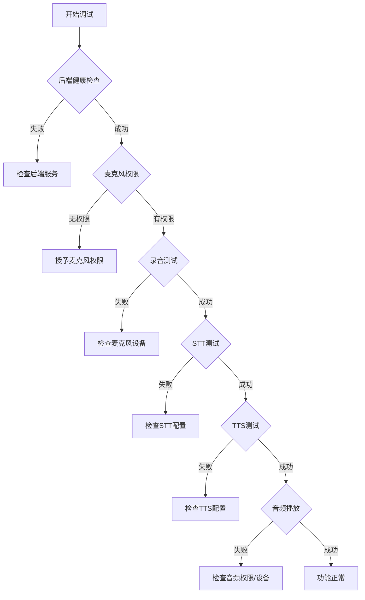

# VITA 语音面试调试指南

## 概述

本指南将帮助您诊断和修复 VITA 语音面试功能中的"没有声音"问题。我们将通过系统化的方法来定位问题并提供解决方案。

## 调试前准备

### 1. 环境要求
- **浏览器**: Chrome/Edge 最新版本（Firefox 可能有兼容性问题）
- **麦克风**: 确保电脑有可用的麦克风设备
- **网络**: 稳定的网络连接
- **权限**: 浏览器需要麦克风权限和自动播放音频权限

### 2. 开启浏览器控制台
1. 在面试页面按 `F12` 或右键选择"检查"
2. 切换到 `Console` 标签页
3. 清除现有日志（点击 🚫 图标）
4. 保持控制台开启以便查看日志

## 系统架构概览

```
前端 (React)          后端 (FastAPI)         AI服务
    │                      │                    │
    ├─[麦克风录音]         │                    │
    ├─[WebSocket]──────────┤                    │
    │                      ├─[语音转文字(STT)]──┤
    │                      ├─[AI处理]───────────┤
    │                      ├─[文字转语音(TTS)]──┤
    ├─[音频播放]←──────────┤                    │
    └─[UI更新]             └────────────────────┘
```

## 分步调试指南

### 步骤 1: 验证后端服务

运行测试脚本：
```bash
python test_voice_interview.py
```

期望看到的输出：
```
✅ PASSED - 健康检查
✅ PASSED - 创建会话
✅ PASSED - WebSocket连接
✅ PASSED - 语音合成端点
```

如果有失败，请检查：
- 后端是否在运行 (`python main.py`)
- 端口 8000 是否被占用
- API 密钥是否配置正确

### 步骤 2: 检查前端日志

#### 2.1 页面加载时的日志
正常情况下应该看到：
```
[RealTimeVoiceInterview:Audio] 开始初始化音频上下文...
[RealTimeVoiceInterview:Audio] 音频上下文创建成功
[RealTimeVoiceInterview:TTS] 开始语音合成，文本长度: XX
```

#### 2.2 点击麦克风按钮时的日志
正常流程：
```
[RealTimeVoiceInterview:Audio] 开始监听流程...
[RealTimeVoiceInterview:Audio] 正在请求麦克风权限...
[RealTimeVoiceInterview:Audio] 成功获取媒体流
[RealTimeVoiceInterview:Audio] MediaRecorder已启动
```

### 步骤 3: WebSocket 连接调试

如果使用 WebSocket 版本（RealTimeVoiceConversation组件），检查：

```
[useVoiceConversation:WebSocket] 正在初始化WebSocket连接...
[useVoiceConversation:WebSocket] WebSocket连接已建立
[useVoiceConversation:WebSocket] 连接状态: 1
```

### 步骤 4: 音频流程调试

#### 4.1 录音过程
```
[RealTimeVoiceInterview:Audio] 音频数据可用，大小: XXXX
[RealTimeVoiceInterview:Audio] 音频Blob创建完成，大小: XXXX
[RealTimeVoiceInterview:Audio] 准备发送音频到后端进行转录...
```

#### 4.2 语音识别(STT)
```
[RealTimeVoiceInterview:Audio] 转录响应状态: 200
[RealTimeVoiceInterview:Audio] 转录成功，文本: "您说的内容"
```

#### 4.3 语音合成(TTS)
```
[RealTimeVoiceInterview:TTS] 发送TTS请求...
[RealTimeVoiceInterview:TTS] TTS响应状态: 200
[RealTimeVoiceInterview:TTS] 音频Blob接收成功，大小: XXXX
[RealTimeVoiceInterview:TTS] 音频开始播放成功
```

## 常见问题及解决方案

### 问题 1: 麦克风无法访问
**症状**: 
- 错误信息："无法访问麦克风，请检查权限设置"
- 日志显示 `NotAllowedError` 或 `NotFoundError`

**解决方案**:
1. 检查浏览器地址栏右侧的麦克风图标
2. 确保网站有麦克风权限
3. 检查系统设置中的麦克风权限
4. 确保没有其他应用占用麦克风

### 问题 2: 音频无法播放
**症状**:
- 日志显示 `NotAllowedError: play() failed`
- 提示"请点击页面任意位置以启用音频播放"

**解决方案**:
1. 点击页面任意位置激活音频
2. 在 Chrome 中访问 `chrome://settings/content/sound`
3. 将网站添加到允许播放声音的列表
4. 尝试先点击"测试语音"按钮

### 问题 3: WebSocket 连接失败
**症状**:
- 日志显示 `WebSocket连接错误`
- 状态显示"未连接"

**解决方案**:
1. 确认后端正在运行
2. 检查防火墙设置
3. 确认 WebSocket 端口（8000）未被占用
4. 尝试刷新页面重新连接

### 问题 4: 语音识别失败
**症状**:
- 录音后没有文字显示
- 日志显示转录失败

**解决方案**:
1. 确保说话音量足够大
2. 检查环境噪音是否过大
3. 确认后端 STT 服务配置正确
4. 检查音频格式是否支持

### 问题 5: 语音合成无声音
**症状**:
- AI回复有文字但没有声音
- 日志显示 TTS 成功但听不到声音

**解决方案**:
1. 检查系统音量设置
2. 确认浏览器标签页未静音
3. 检查音频输出设备
4. 验证 TTS API 密钥是否有效

## 高级调试技巧

### 1. 网络请求监控
在浏览器开发者工具中：
1. 切换到 `Network` 标签
2. 过滤 `WS`（WebSocket）和 `XHR` 请求
3. 检查请求状态和响应内容

### 2. 音频设备测试
```javascript
// 在控制台运行以下代码测试音频设备
navigator.mediaDevices.enumerateDevices()
  .then(devices => {
    console.log('音频输入设备:');
    devices.filter(d => d.kind === 'audioinput').forEach(d => console.log(d));
    console.log('音频输出设备:');
    devices.filter(d => d.kind === 'audiooutput').forEach(d => console.log(d));
  });
```

### 3. 手动测试音频播放
```javascript
// 测试音频播放功能
const audio = new Audio();
audio.src = 'data:audio/wav;base64,__REMOVED_API_KEY__bF1fdJivrJBhNjVgodDbq2EcBj+a2/LDciUFLIHO8tiJNwgZaLvt559NEAxQp+PwtmMcBjiR1/LMeSwFJHfH8N2QQAoUXrTp66hVFApGn+DyvmwhBTGS3Oy9diMFl2z';
audio.play().then(() => {
  console.log('✅ 音频播放测试成功');
}).catch(e => {
  console.error('❌ 音频播放测试失败:', e);
});
```

### 4. WebSocket 连接测试
```javascript
// 测试 WebSocket 连接
const ws = new WebSocket('ws://localhost:8000/api/v1/ws/voice/test-session');
ws.onopen = () => console.log('✅ WebSocket 连接成功');
ws.onerror = (e) => console.error('❌ WebSocket 错误:', e);
ws.onmessage = (e) => console.log('📥 收到消息:', e.data);
```

## 完整调试流程图



## 日志收集脚本

在控制台运行以下脚本收集完整日志：

```javascript
// 收集调试信息
const debugInfo = {
  timestamp: new Date().toISOString(),
  userAgent: navigator.userAgent,
  permissions: {},
  devices: [],
  errors: []
};

// 检查权限
navigator.permissions.query({name: 'microphone'}).then(result => {
  debugInfo.permissions.microphone = result.state;
});

// 检查设备
navigator.mediaDevices.enumerateDevices().then(devices => {
  debugInfo.devices = devices.map(d => ({
    kind: d.kind,
    label: d.label || 'Unknown',
    deviceId: d.deviceId ? 'Present' : 'Missing'
  }));
});

// 输出调试信息
setTimeout(() => {
  console.log('=== VITA 语音调试信息 ===');
  console.log(JSON.stringify(debugInfo, null, 2));
  console.log('请将以上信息复制并提供给技术支持');
}, 1000);
```

## 快速修复检查清单

- [ ] 后端服务正在运行
- [ ] 浏览器已授予麦克风权限
- [ ] 系统音量未静音
- [ ] 使用 Chrome/Edge 浏览器
- [ ] 网络连接稳定
- [ ] 环境变量配置正确（API密钥等）
- [ ] 没有浏览器扩展阻止音频
- [ ] 页面已点击激活音频播放

## 联系支持

如果以上步骤都无法解决问题，请收集以下信息：
1. 浏览器控制台的完整日志
2. 网络请求截图
3. 运行调试脚本的输出
4. 系统和浏览器版本信息

将这些信息发送给技术支持团队以获得进一步帮助。 